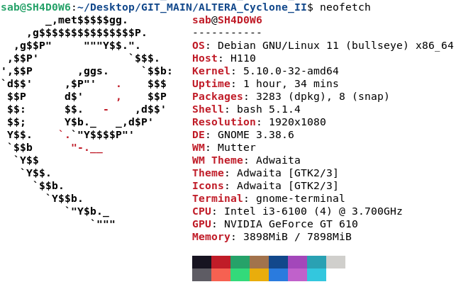

# ALTERA_Cyclone_II
ALTERA FPGA, Cyclone II: From Basics to Mastery


1. Introduction to FPGA and Cyclone II
   - What is an FPGA?
     Field-Programmable Gate Array (FPGA) is a semiconductor device that can be programmed to perform a wide range of tasks.
   - What is ALTERA Cyclone II?
     Cyclone II is a low-cost FPGA by ALTERA (now Intel), commonly used in academic and industrial projects.
   
   Key Concepts:
   - Learn basic digital logic: Logic gates, flip-flops, counters, and multiplexers.
   - Understand FPGA architecture: Configurable logic blocks, I/O blocks, and routing.


## PDF

[Cyclone II Device Handbook, Volume 1](src/D_sheet.pdf)

[Product Marking Information](src/mark_info.pdf)

[Pin Information for the Cyclone II EP2C5 Device](src/pinout.pdf)


2. Setting Up the Environment
   - Quartus II Software: This is the development tool for programming Cyclone II. Download and install Intel Quartus II.
   - Installation on Debian:
     tar -xvf quartus_linux.tar
     cd quartus_linux
     sudo ./setup.sh
   - Ensure Cyclone II device support is installed.


## Device and Operating Environment Details: 

##  lsb_release -a

```
Distributor ID:	Debian
Description:	Debian GNU/Linux 11 (bullseye)
Release:	11
Codename:	bullseye
```

[Debian]()
<p align="center">
  
</p>


## Software download 

### Intel® Quartus® II Web Edition Design Software Version 13.0sp1 for Linux

[link](https://www.intel.com/content/www/us/en/software-kit/711790/intel-quartus-ii-web-edition-design-software-version-13-0sp1-for-linux.html)

Size: 4.5 GB

sha1: 2b110eff0d544bcda4013e265f6feaa507482357


3. Basic Quartus Project Setup
   - Create a new project in Quartus II.
   - Select Cyclone II as the target FPGA device.
   - Design a simple AND gate using Verilog or VHDL.
     module and_gate (input A, input B, output Y);
         assign Y = A & B;
     endmodule
   - Synthesize, simulate, and program your FPGA.

4. Programming Languages for FPGA
   - Verilog and VHDL are the most common hardware description languages (HDLs) for FPGA design.

5. Flashing the Cyclone II FPGA
   - Compile the design in Quartus and upload the compiled .sof file to the FPGA using the Quartus Programmer tool.

6. Intermediate Concepts:
   - Finite State Machines (FSMs): Essential for controlling digital systems.
   - Memory in FPGA: Learn about Block RAM (BRAM) and Distributed RAM.
   - Using IP Cores: Quartus provides pre-built IP Cores to integrate into designs.

7. Using I/O Peripherals
   - Interface with LEDs, 7-Segment Displays, and Buttons.

8. Advanced Topics
   - Embedded Processors, DSP Blocks, and High-Speed I/O.

9. Simulation and Debugging
   - Use Quartus’ simulation and SignalTap tools for debugging.

10. Mastering FPGA
   - Implement complex digital systems like Image Processing Pipelines, Signal Processing, and Custom Processor Design.

Key Tools for ALTERA Cyclone II FPGA:
   1. Quartus II – Development environment.
   2. ModelSim – Simulation and testing.
   3. USB-Blaster Programmer – Programming the FPGA.

Helpful Resources:
   - Intel FPGA University Program: University Program
   - ALTERA (Intel) Documentation: Documentation


   - https://www.intel.com/content/www/us/en/support/programmable/support-resources/devices/cyclone-ii-support.html

